# 醫療廢棄物管理系統 - 資料庫架構圖

## EERD (Enhanced Entity-Relationship Diagram)

### 關聯基數說明
- `1..1` : 必須且唯一
- `0..1` : 可選且唯一
- `1..*` : 必須且多個
- `0..*` : 可選且多個

```mermaid
classDiagram
    %% ========================================
    %% Main Module - 使用者管理
    %% ========================================

    class 使用者User {
        <<Entity>>
        +int id PK "使用者ID"
        +string username "使用者名稱"
        +string email "電子郵件"
        +string password "密碼"
        +datetime date_joined "加入日期"
    }

    class 使用者設定檔UserProfile {
        <<Entity>>
        +int id PK "設定檔ID"
        +int user_id FK "使用者ID"
        +string theme_preference "主題偏好"
        +datetime created_at "建立時間"
        +datetime updated_at "更新時間"
    }

    使用者User "1..1" -- "0..1" 使用者設定檔UserProfile : 擁有

    %% ========================================
    %% WasteManagement Module - 廢棄物管理
    %% ========================================

    class 部門Department {
        <<Entity>>
        +int id PK "部門ID"
        +string name UK "部門名稱"
        +int display_order "顯示順序"
        +bool is_active "是否啟用"
        +datetime created_at "建立時間"
        +datetime updated_at "更新時間"
    }

    class 廢棄物種類WasteType {
        <<Entity>>
        +int id PK "種類ID"
        +string name UK "種類名稱"
        +string unit "單位"
        +bool is_active "是否啟用"
        +datetime created_at "建立時間"
        +datetime updated_at "更新時間"
    }

    class 廢棄物記錄WasteRecord {
        <<Entity>>
        +int id PK "記錄ID"
        +string date "日期YYYY-MM"
        +int department_id FK "部門ID"
        +int waste_type_id FK "廢棄物種類ID"
        +float amount "數量"
        +datetime created_at "建立時間"
        +datetime updated_at "更新時間"
        +int created_by FK "建立者"
        +int updated_by FK "更新者"
    }

    class 一般事業廢棄物產出表GeneralWasteProduction {
        <<Entity>>
        +string date PK "日期YYYY-MM"
        +float tainan "南區產量"
        +float renwu "仁武產量"
        +float field_1~10 "動態欄位1-10"
        +float total "總計"
    }

    class 生物醫療廢棄物產出表BiomedicalWasteProduction {
        <<Entity>>
        +string date PK "日期YYYY-MM"
        +float red_bag "紅袋產量"
        +float yellow_bag "黃袋產量"
        +float total "總計"
    }

    class 洗腎桶軟袋產出及處理費用表DialysisBucketSoftBag {
        <<Entity>>
        +string date PK "日期YYYY-MM"
        +float produced_dialysis_bucket "洗腎桶產出"
        +float produced_soft_bag "軟袋產出"
        +int cost "處理費用"
    }

    class 藥用玻璃產出及處理費用表PharmaceuticalGlass {
        <<Entity>>
        +string date PK "日期YYYY-MM"
        +float produced "產量"
        +int cost "處理費用"
    }

    class 紙鐵鋁罐塑膠玻璃產出及回收收入表PaperIronAluminumCanPlasticGlass {
        <<Entity>>
        +string date PK "日期YYYY-MM"
        +float paper_produced "紙產量"
        +float iron_aluminum_can_produced "鐵鋁罐產量"
        +float plastic_produced "塑膠產量"
        +float glass_produced "玻璃產量"
        +int recycling_revenue "回收收入"
    }

    部門Department "0..*" -- "1..1" 廢棄物記錄WasteRecord : 產生
    廢棄物種類WasteType "0..*" -- "1..1" 廢棄物記錄WasteRecord : 分類
    使用者User "0..1" -- "0..*" 廢棄物記錄WasteRecord : 建立更新

    %% ========================================
    %% WasteTransportation Module - 清運追蹤
    %% ========================================

    class 事業機構Enterprise {
        <<Entity>>
        +string enterprise_code PK "事業機構代碼"
        +string enterprise_name "事業機構名稱"
    }

    class 清除者Transporter {
        <<Entity>>
        +string transporter_code PK "清除者代碼"
        +string transporter_name "清除者名稱"
        +text other_transporters "其他清除者"
    }

    class 處理者TreatmentFacility {
        <<Entity>>
        +string treatment_facility_code PK "處理者代碼"
        +string treatment_facility_name "處理者名稱"
    }

    class 再利用者Recycler {
        <<Entity>>
        +string recycler_code PK "再利用者代碼"
        +string recycler_name "再利用者名稱"
        +string recycling_purpose "再利用用途"
        +text recycling_purpose_description "再利用用途說明"
        +string recycling_method "再利用方式"
        +string recycler_type "再利用者性質"
        +datetime recycling_completion_datetime "再利用完成日期時間"
        +string actual_recycler_vehicle_number "實際運載車號"
    }

    class 製程Process {
        <<Entity>>
        +string process_code PK "製程代碼"
        +string process_name "製程名稱"
    }

    class 廢棄物物質WasteSubstance {
        <<Entity>>
        +string waste_substance_code PK "廢棄物物質代碼"
        +string waste_substance_name "廢棄物物質名稱"
    }

    class 清運車輛TransportVehicle {
        <<Entity>>
        +string transport_vehicle_number PK "清除運載車號"
        +string transporter_code FK "清除者代碼"
    }

    class 處理車輛TreatmentVehicle {
        <<Entity>>
        +string treatment_vehicle_number PK "處理運載車號"
        +string treatment_facility_code FK "處理者代碼"
    }

    class 回收車輛RecoveryVehicle {
        <<Entity>>
        +string recovery_vehicle_number PK "回收運載車號"
        +string recycler_code FK "再利用者代碼"
    }

    class 申報單Declaration {
        <<Entity>>
        +string declaration_code PK "申報單代碼"
        +string enterprise_code FK "事業機構代碼"
        +datetime declaration_datetime "申報日期時間"
        +float declared_weight "申報重量"
    }

    class 清運單Transportation {
        <<Entity>>
        +string transportation_code PK "清運單代碼"
        +string transporter_code FK "清除者代碼"
        +datetime transportation_datetime "清運日期時間"
        +string transport_vehicle_number FK "清除運載車號"
        +datetime delivery_datetime "運送日期時間"
    }

    class 處理單Treatment {
        <<Entity>>
        +string treatment_code PK "處理單代碼"
        +string treatment_facility_code FK "處理者代碼"
        +datetime receipt_datetime "收受日期時間"
        +string treatment_vehicle_number FK "處理運載車號"
        +string intermediate_treatment_method "中間處理方式"
        +string final_disposal_method "最終處置方式"
        +datetime treatment_completion_datetime "處理完成日期時間"
    }

    class 回收單Recovery {
        <<Entity>>
        +string recovery_code PK "回收單代碼"
        +string recycler_code FK "再利用者代碼"
        +datetime recovery_datetime "回收日期時間"
        +string recovery_vehicle_number FK "回收運載車號"
    }

    class 廢棄物物質IDWasteSubstanceId {
        <<Entity>>
        +int waste_substance_id PK "廢棄物物質ID"
        +string process_code FK "製程代碼"
        +string waste_substance_code FK "廢棄物物質代碼"
    }

    class 聯單Manifest {
        <<Entity>>
        +string manifest_number "聯單編號"
        +int waste_substance_id FK "廢棄物物質ID"
        +string declaration_code FK "申報單代碼"
        +string vehicle_number "運載車號"
        +string transportation_code FK "清運單代碼"
        +string treatment_code FK "處理單代碼"
        +string recovery_code FK "回收單代碼"
        +bool is_visible "是否可見"
    }

    事業機構Enterprise "0..*" -- "1..1" 申報單Declaration : 提交
    清除者Transporter "0..*" -- "1..1" 清運車輛TransportVehicle : 擁有
    清除者Transporter "0..*" -- "1..1" 清運單Transportation : 執行
    處理者TreatmentFacility "0..*" -- "1..1" 處理車輛TreatmentVehicle : 擁有
    處理者TreatmentFacility "0..*" -- "1..1" 處理單Treatment : 執行
    再利用者Recycler "0..*" -- "1..1" 回收車輛RecoveryVehicle : 擁有
    再利用者Recycler "0..*" -- "1..1" 回收單Recovery : 執行
    製程Process "0..*" -- "1..1" 廢棄物物質IDWasteSubstanceId : 產生
    廢棄物物質WasteSubstance "0..*" -- "1..1" 廢棄物物質IDWasteSubstanceId : 分類
    廢棄物物質IDWasteSubstanceId "1..*" -- "1..1" 聯單Manifest : 追蹤
    申報單Declaration "1..*" -- "1..1" 聯單Manifest : 申報
    清運單Transportation "1..*" -- "1..1" 聯單Manifest : 清運
    處理單Treatment "0..*" -- "0..1" 聯單Manifest : 處理
    回收單Recovery "0..*" -- "0..1" 聯單Manifest : 回收
    清運車輛TransportVehicle "0..*" -- "1..1" 清運單Transportation : 使用
    處理車輛TreatmentVehicle "0..*" -- "1..1" 處理單Treatment : 使用
    回收車輛RecoveryVehicle "0..*" -- "1..1" 回收單Recovery : 使用

    %% ========================================
    %% WastePrediction Module - 營運數據
    %% ========================================

    class 醫院營運數據表HospitalOperationalData {
        <<Entity>>
        +string date PK "日期YYYY-MM"
        +float bed_occupancy_rate "佔床率"
        +int surgical_cases "手術人次"
        +int doctor_count "醫師人數"
        +int nurse_count "護理人數"
        +int total_staff_count "全院員工數"
        +int outpatient_visits "門診人次"
        +int emergency_visits "急診人次"
        +int inpatient_visits "住院人次"
        +float medical_waste_total "廢棄物總量"
    }
```

---

## 資料表列表

### Main 模組
| 中文名稱 | 資料庫表名 (db_table) |
|---------|---------------------|
| 使用者 | auth_user (Django內建) |
| 使用者設定檔 | Main_userprofile |

### WasteManagement 模組
| 中文名稱 | 資料庫表名 (db_table) |
|---------|---------------------|
| 部門 | departments |
| 廢棄物種類 | waste_types |
| 廢棄物記錄 | waste_records |
| 一般事業廢棄物產出表 | general_waste_production |
| 生物醫療廢棄物產出表 | biomedical_waste_production |
| 洗腎桶軟袋產出及處理費用表 | dialysis_bucket_soft_bag_production_and_disposal_costs |
| 藥用玻璃產出及處理費用表 | pharmaceutical_glass_production_and_disposal_costs |
| 紙鐵鋁罐塑膠玻璃產出及回收收入表 | paper_iron_aluminum_can_plastic_and_glass_production_and_recycling_revenue |

### WasteTransportation 模組
| 中文名稱 | 資料庫表名 (db_table) |
|---------|---------------------|
| 事業機構 | enterprise |
| 清除者 | transporter |
| 處理者 | treatment_facility |
| 再利用者 | recycler |
| 製程 | process |
| 廢棄物/物質 | waste_substance |
| 清運車輛 | transport_vehicle |
| 處理車輛 | treatment_vehicle |
| 回收車輛 | recovery_vehicle |
| 申報單 | declaration |
| 清運單 | transportation |
| 處理單 | treatment |
| 回收單 | recovery |
| 廢棄物/物質ID | waste_substance_id |
| 聯單 | manifest |

### WastePrediction 模組
| 中文名稱 | 資料庫表名 (db_table) |
|---------|---------------------|
| 醫院營運數據表 | hospital_operational_data |

---

## 索引與約束

### 唯一約束 (Unique Constraints)
- **部門**: name
- **廢棄物種類**: name
- **廢棄物記錄**: (date, department, waste_type)
- **廢棄物/物質ID**: (process_code, waste_substance_code)
- **聯單**: (manifest_number, waste_substance_id)

### 索引 (Indexes)
- **部門**: name, is_active
- **廢棄物種類**: name, is_active
- **廢棄物記錄**: date, (department, date), (waste_type, date), created_by, updated_by
- **聯單**: (is_visible, manifest_number), (is_visible, id DESC), declaration, transportation, treatment, recovery

---

## 建立日期
2025-11-01